## Summary:

The main concept students needed to understand in this Tinker was how a simple mood classification system works from start to finish, including preprocessing text, scoring it based on rules, and converting that score into a final label. Students also needed to understand that both the rule based and ML versions are heavily shaped by the data and labels they create. One of the biggest likely struggles is handling posts that are ambiguous, sarcastic, slang-based, emoji-based, or show mixed emotions, since those cases are not always easy even for us to label consistently. AI was helpful for understanding the starter code, brainstorming dataset examples, and suggesting simple implementation ideas, but it could also be misleading when its suggestions were too repetitive, too generic, or more complicated than what the project actually needed. A good way to guide students without giving away the answer is to ask them to walk through what happens to one sample post from input to final label and explain where the model may be going wrong. The ML comparison also helps show that higher accuracy does not always mean the model is truly better, especially when it is being tested on the same small dataset it trained on.

---

## Where AI Was Helpful vs Misleading:

### Helpful:

- AI was helpful for understanding the relationship between `SAMPLE_POSTS` and `TRUE_LABELS`.
- It was also helpful for explaining the overall flow of the project, especially how `preprocess()`, `score_text()`, and `predict_label()` work together.
- It helped brainstorm ideas for additional dataset examples, especially edge cases like sarcasm, slang, emojis, and mixed emotions.
- It was useful for suggesting simple implementation ideas for preprocessing, negation handling, and label mapping.
- It was also helpful when checking whether an implementation idea made sense before adding it to the code.
- It was useful for explaining why a specific failure happened, such as why `"That movie was sick"` was initially classified as neutral.

### Misleading:

- AI could be misleading when it gave suggestions that were too repetitive or unrealistic, especially when brainstorming new posts.
- Sometimes it suggested more advanced or more complex solutions than the activity really needed.
- It could make something sound correct even when it still needed to be verified against the actual code and project goals.
- Some suggestions were technically valid, but not always the best choice for a beginner-friendly implementation.
- It could also make students feel like they should solve everything right away instead of first building a simple version and then improving it step by step.
- In the ML section, AI explanations could sound convincing even if students did not stop to think about the fact that the model was trained and tested on the same dataset.

---

## Parts that Can Be Confusing for Students:

- How to handle posts that are hard to label and naturally confusing, such as sarcasm, mixed emotions, unclear messaging, slang, emojis, and subjective meaning where one person may label a post as positive while someone else may label it as neutral or negative.

- What happens at every step of the process and how it flows throughout the system:
  `input text -> preprocess it -> score it -> turn the score into a label`

- Understanding the difference between `neutral` and `mixed`.

- Understanding that `SAMPLE_POSTS` and `TRUE_LABELS` are parallel lists, and that every post must always have exactly one matching label.

- Understanding why the model may predict something incorrectly even when the code is technically working.

- Understanding that the rule based model does not understand language like a human does. It only reacts to words and rules that were explicitly added.

- Understanding why the ML model may behave differently from the rule based model even though both use the same dataset.

- Understanding why a high accuracy score in `ml_experiments.py` does not necessarily mean the model will perform well on new unseen examples.

---

## Ways to Guide Students Without Giving the Answer:

- Start with understanding the basics of the project. Encourage students to use Copilot as an assistant to better understand what they were given, instead of just using it to generate code.

- For example, they can prompt Copilot to help explain in simple words:
  - how `SAMPLE_POSTS` and `TRUE_LABELS` relate to each other and why they must always have the same length
  - what the role of `preprocess()`, `score_text()`, and `predict_label()` is in `mood_analyzer.py` in the overall flow of the system
  - how one sample post flows from start to finish through the model and what the main steps are

- Ask guiding questions such as:
  - What words in this post affected the score?
  - Why do you think the model chose this label?
  - What happens if there is a negation like `not happy` or `not bad`?
  - Is this post really neutral, or is it mixed?
  - What word or phrase is the model missing here?

- Encourage students to brainstorm ideas with Copilot for additional posts and labels, but remind them to reject suggestions that sound repetitive, unrealistic, or unclear.

- Ask them whether they have thought about all the possible edge cases, such as sarcasm, slang, emojis, posts that contain both positive and negative feelings, and negations.

- If they are stuck, guide them to print tokens, scores, or intermediate results instead of jumping straight to a completely new solution.

---

## Things for Students to Understand/Realize:

- It is important to understand that the implementation should not be perfect right away. A big part of the activity is understanding where and why the model fails at each step.

- There is no need to support every possible label or edge case immediately. For example, students can first implement positive, negative, and neutral moods and make sure those work properly. Later they can move to more complex tasks like mixed mood, but only after the basic classifications work properly.

- A model can be working correctly according to its own rules and still produce a wrong or weak prediction.

- Labels are not always objective. Some posts are naturally ambiguous, and disagreement between humans is normal.

- The dataset matters a lot. The words and labels students add directly shape how both the rule based and ML versions behave.

- If students get a high accuracy score when running `ml_experiments.py`, they need to ask themselves whether the model is being trained and evaluated on the same dataset.

- If the same dataset is used for both training and evaluation, a high accuracy score mainly shows that the model fit that small dataset well. It does not necessarily mean the model will perform as well on a different, unseen dataset.

- AI suggestions should always be treated as ideas to inspect and verify, not as the final answer.

---

## What They Have in the Starter Code and What’s Missing:

- Initial dataset with starter mood words, sample posts, and matching labels  
  -> needs to be expanded

- Every post has one label  
  -> students must keep it that way when adding new posts

- In `mood_analyzer.py`:
  - `preprocess()` already exists, but it is basic  
    -> can be improved
  - `score_text()` needs to be implemented
  - `predict_label()` needs to be implemented
  - `explain()` is partially implemented and optional  
    -> can also be improved

- In `main.py`:
  - the evaluation logic is already there
  - the batch demo is already there
  - the interactive loop is already there

- In `ml_experiments.py`:
  - the ML workflow is already provided
  - students mainly need to run it, compare its behavior, and reflect on how it differs from the rule based approach

---

## _Implementation:_

### PROMPT 1 (something that could help students better understand what they were provided):

Look at `dataset.py`. Can you explain in simple words how `SAMPLE_POSTS` and `TRUE_LABELS` relate to each other, and why they must always have the same length?

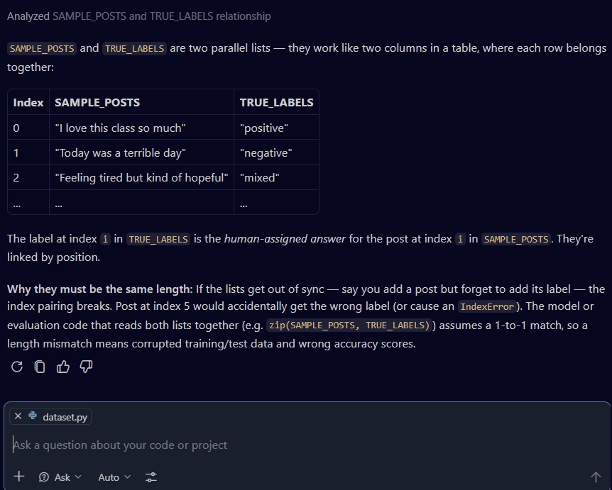

---

### PROMPT 2:

Look at `mood_analyzer.py`. Can you explain the role of `preprocess`, `score_text`, and `predict_label` in the overall flow of this project?

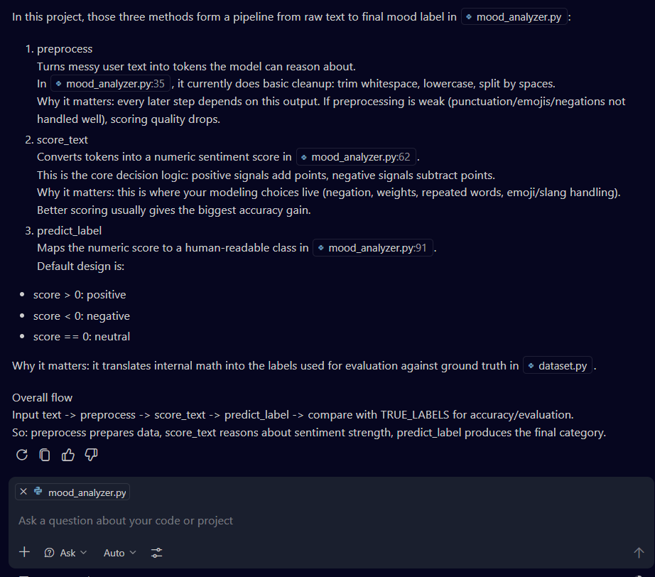

---

### PROMPT 3 (brainstorming ideas for new posts and labels):

Can you suggest 10 to 15 short realistic social-media-style posts for a mood classification dataset, including slang, emojis, sarcasm, and mixed feelings?

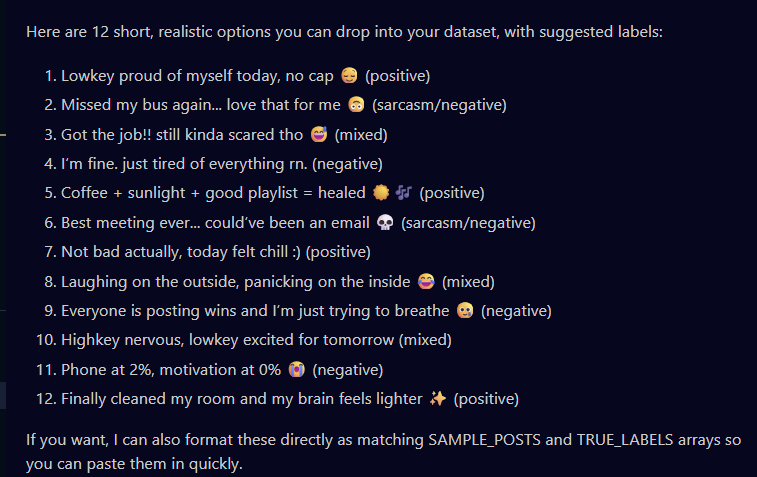

=> Copilot included emojis and slang in almost every single example, so the prompt needed to be adjusted to get more diverse posts.

Final posts that were added to `dataset.py`:

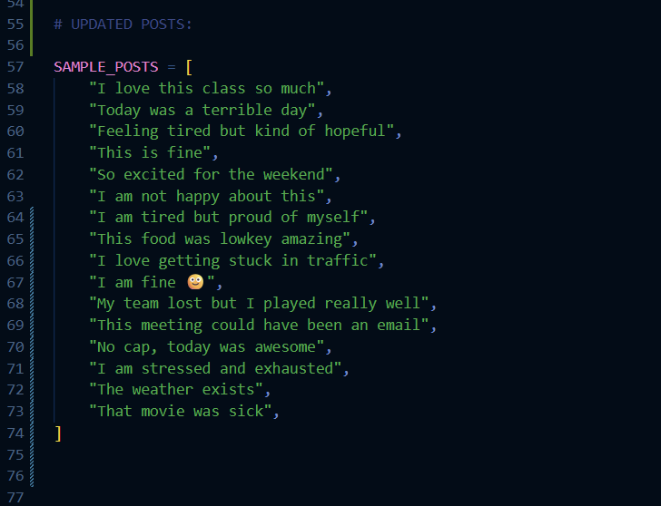

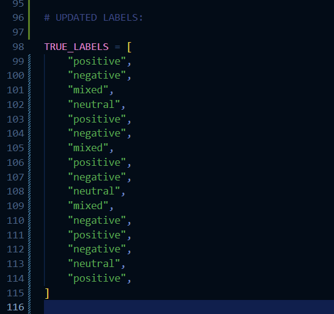

---

### PROMPT 4 (improving `preprocess()` method):

Initial improvement of `preprocess()` method:

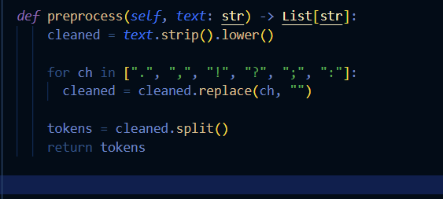

=> Good implementation, but it could still be improved a little more.

Look at `preprocess()` in `mood_analyzer.py`. I want a simple beginner-friendly improvement that lowercases, removes common punctuation, keeps emojis if possible, and returns tokens. Does this implementation make sense?

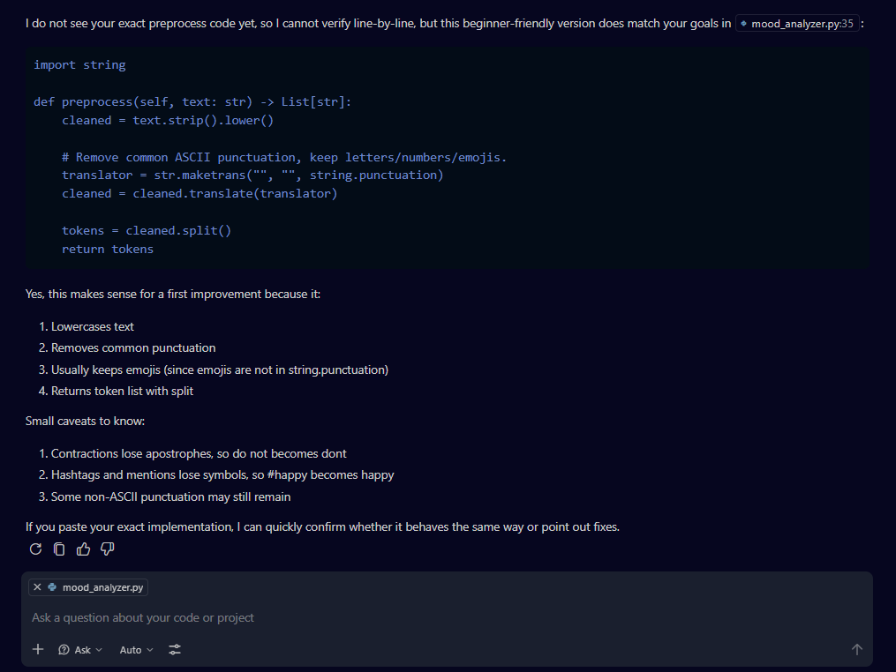

=> Better implementation in my opinion, because it removes unnecessary punctuation without specifically listing each symbol and still keeps emojis.

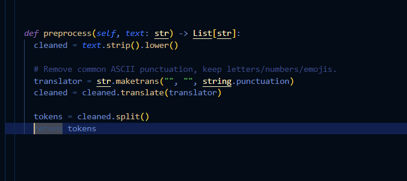

---

### PROMPT 5 (implementing `score_text()` method):

Look at `score_text()` in `mood_analyzer.py`. I want a simple beginner-friendly implementation that scores positive and negative words and handles simple negation like `not happy` and `not bad`. Does this approach make sense?

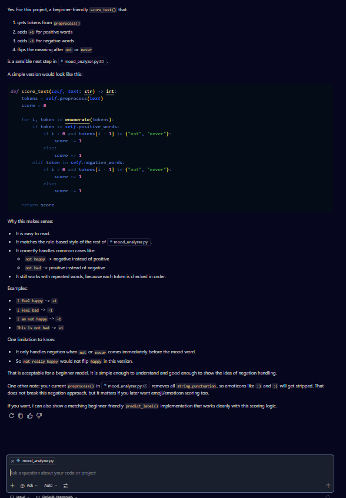

=> This looks like a pretty good implementation and it is simple enough for now.

=> One small improvement could be adding `"no"` as another negation word, since it could also potentially change the mood:

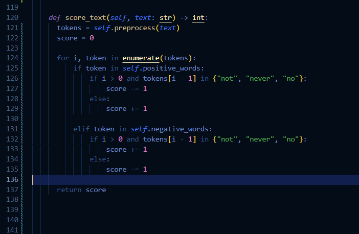

---

### PROMPT 6 (`predict_label()` method implementation):

Look at `predict_label()` in `mood_analyzer.py`. I want a simple beginner-friendly version that maps positive score to positive, negative score to negative, and zero to neutral. Does this fit the current `score_text()` logic?

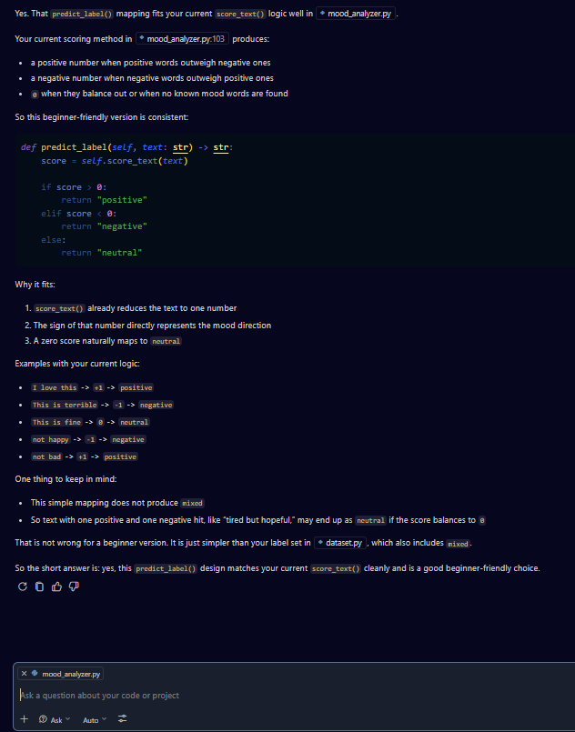

=> This looks like a good initial implementation of the `predict_label()` method.

=> After adding it to `mood_analyzer.py`, I ran `python main.py` to test the implementation:

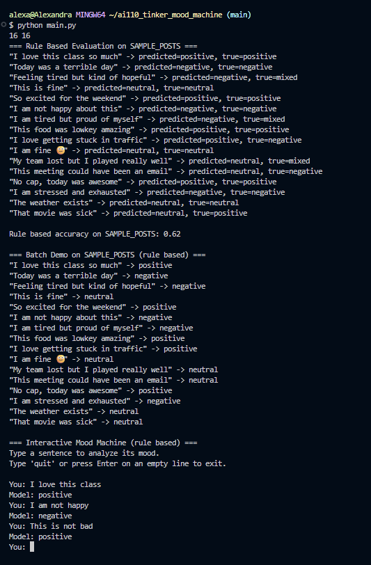

---

Adding slang words to the `POSITIVE_WORDS` list:

- `sick`
- `fire`

Adding slang words to the `NEGATIVE_WORDS` list:

- `mid`

Testing `"That movie was sick"` BEFORE the change:

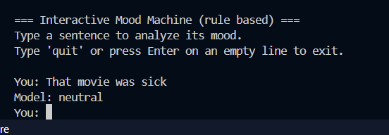

Testing `"That movie was sick"` AFTER the change:

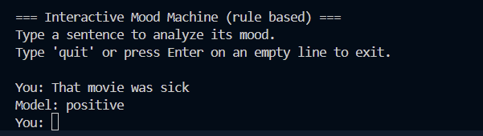

---

### PROMPT 7:

Why did the rule based model classify `"That movie was sick"` as neutral, and would adding `"sick"` to `POSITIVE_WORDS` be a reasonable targeted fix for this project?

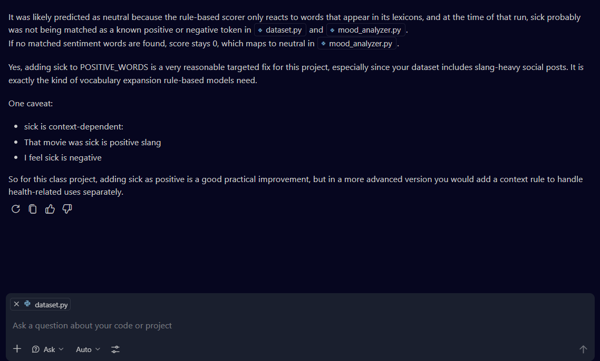

One clear failure case was the sentence `"That movie was sick"`, which the model originally predicted as neutral. I used Copilot to help reason through why that happened, and the explanation was that the rule based model only reacts to words already present in its vocabulary lists. Since `sick` was not in `POSITIVE_WORDS` or `NEGATIVE_WORDS`, it was ignored, which left the score at zero and led to a neutral prediction. I then made a targeted fix by adding `sick` to `POSITIVE_WORDS` and reran the model to see whether the prediction improved. This helped for slang usage like `"That movie was sick"`, while also showing an important limitation, since `sick` can mean something negative in other contexts like `"I feel sick"`.

---

Running the ML model in order to compare it to the rule based model using `python ml_experiments.py`:

- Creating a virtual environment folder: `python -m venv .venv`
- Activating it: `source .venv/Scripts/activate`
- Installing requirements: `python -m pip install -r requirements.txt`
- Running: `python ml_experiments.py`

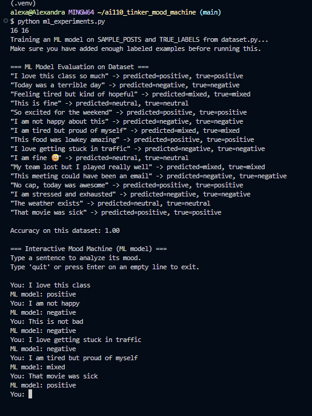

=> This simple ML model does a good job identifying true positives, true negatives, sarcasm-like patterns, mixed emotions, and slang that appeared in the dataset. However, it does not do as well with negations. It also does well with emojis and slang that were introduced to the model through our dataset. However, it would still need to be adjusted, or the dataset would need to be expanded, in order to better cover new emojis, new slang, and more unseen examples.

---

### PROMPT 8 (using Copilot to understand the difference in performance between rule based and simple ML models):

Why might the ML model behave differently from the rule based model even though both use the same `SAMPLE_POSTS` and `TRUE_LABELS`?

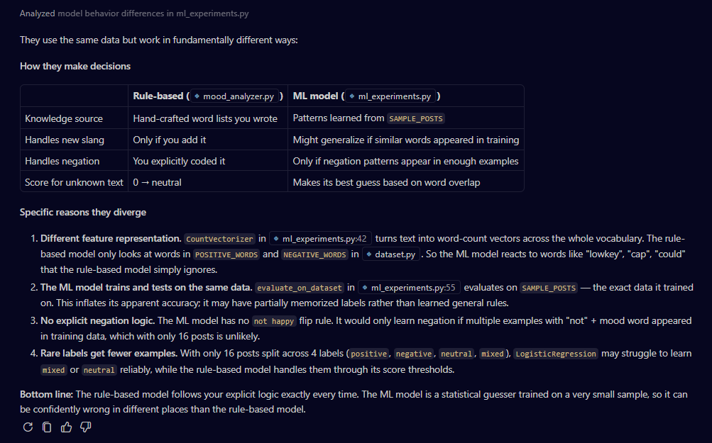

## NOTE:

It is important to understand that even though the ML model showed an accuracy of `1.00`, it was trained and tested on the same dataset.

=> So this does not mean the ML model is truly perfect. It means it fit this small dataset very well, and it may have partially memorized patterns from it.

Comparison of performance of our two models:

- The rule based model did better on specific hard-coded patterns, such as simple negation.
- The ML model did better on some examples because of learned word associations from the small dataset.
- The ML model looked stronger on this dataset, but that does not guarantee it would perform as well on new unseen posts.
